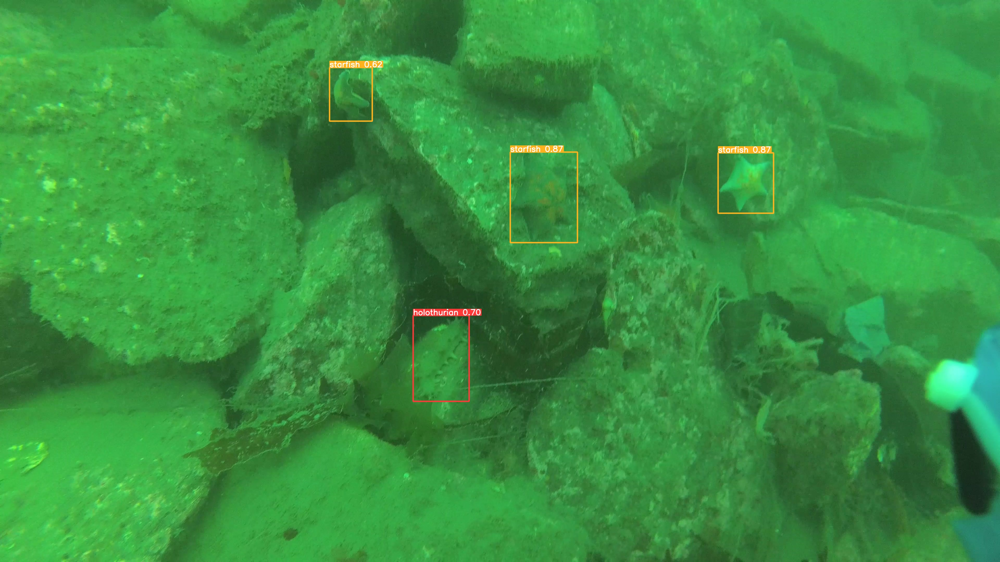
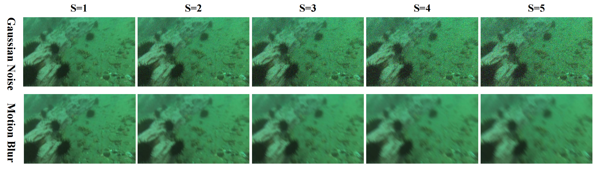

# SEANet
Underwater object detection is significantly hindered by low-contrast visual conditions and extreme scale variation among marine organisms. To address these challenges, we propose SEANet, a single-stage detection framework specifically tailored for underwater environments. First, the Multi-Scale Detail Amplification Module (MDAM) strengthens feature extraction by expanding receptive fields to capture fine-grained cues in complex backgrounds. Besides, we design the Semantic Enhancement Feature Pyramid (SE-FPN), which incorporates a Fore-Background Contrast Attention (FBC) mechanism. SE-FPN assists in enhancing multi-scale feature integration and moderately improves contrast between targets and their surroundings, helping the network focus more effectively on low-contrast objects in underwater scenes. Experiments on underwater datasets demonstrate that SEANet achieves competitive performance, with the highest AP recorded at 67.0% on the RUOD dataset.



## 🚀 Installation

- Clone this repository
```bash
git clone https://github.com/Nicoleyk/SEANet.git
cd SEANet
```
- Create a conda virtual environment and activate it
```bash
conda create -n seanet python=3.8+
conda activate seanet
```
- Install required dependencies
```bash
pip install -r requirements.txt
```
## 📂 Data Preparation
Download underwater object detection datasets such as [RUOD](https://pan.baidu.com/s/165NIEGmyHIVeCy47WIF8LA?pwd=w35g)
It is recommended to extract the datasets outside the project directory. The suggested folder structure is as follows:
```bash
data 
├── images 
│   ├── train 
│   └── val 
├── labels 
│   ├── train 
|   ├── val 
|   ├── train.txt 
└── └── val.txt
```
## 🧪 Evaluation
- [Download the pretrained model weights](https://pan.baidu.com/s/1pDGsseIr2M4b0sYFWN8ALg?pwd=9abj) and place it in:
```bash
runs/train/final/
```
- Evaluate on the dataset
```bash
python val.py --data datasets/ruod.yaml --img 640 --batch 32 --conf 0.001 --iou 0.7 --device 0 --weights runs/train/final/weights_ruod/best.pt
```
## 🔧 Robustness Evaluation
We also provide robustness subsets of RUOD(Gaussian Noise and Motion Blur at 5 severity levels),you can download them from [RUOD]( https://pan.baidu.com/s/165NIEGmyHIVeCy47WIF8LA?pwd=w35g )


1. Evaluate on Gaussian Noise
```bash
python val.py --data datasets/ruod-gussian.yaml --img 640 --batch 32 --conf 0.001 --iou 0.7 --device 0 --weights runs/train/final/weights_ruod/best.pt
```
2. Evaluate on Motion Blur
```bash
python val.py --data datasets/ruod-motionblur.yaml --img 640 --batch 32 --conf 0.001 --iou 0.7 --device 0 --weights runs/train/final/weights_ruod/best.pt
```

## 🧪 Train
```bash
nohup python -u train.py --workers 4 --batch 16 --data datasets/yourdataset.yaml --img 640 --cfg models/detect/seanet.yaml --weights '' --hyp hyp.scratch-high.yaml --epochs 300 --close-mosaic 10  &
```

## 📚 Citation
If you find this project useful in your research, please consider citing the following preprint:
```bash
@misc{yang2025seanet,
  title={Advanced Semantic Amplification for Underwater Object Detection in Low-Contrast and Multi-Scale},
  note={The Visual Computer},
  year={2025}
}
```
